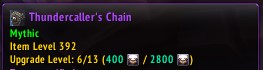
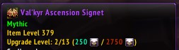
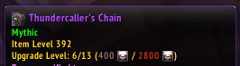
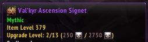

# Description and Features

Snow's Upgrade Tooltip provides information about upgrade costs for upgradable items.

# Inspiration

Heavily based on [AzerPUG's ToolTips](https://www.curseforge.com/wow/addons/azerpugs-tooltips) without covering all the features it provides.

After trying to fix AzerPUG's for 10.0.2 (without success) decided to do a quick alternative to show as little data as needed.

It will color code the "next" and "max" upgrades based on valor availability as well as m+ rating requirements.

**Known issues**: It currently only works with valor upgrades.

# Examples

## Example 1

- m+ rating ok for next upgrade
- m+ rating ok for max upgrade
- Enough valor for both upgrades

## Example 2

- m+ rating ok for next upgrade
- m+ rating not enough for max upgrade
- Enough valor at least for next upgrade

## Example 3

- m+ rating ok for next upgrade
- m+ rating not enough for max upgrade
- Not enough valor at least for next upgrade

## Example 4

- m+ rating ok for next upgrade
- m+ rating ok for max upgrade
- Not enough valor to upgrade

